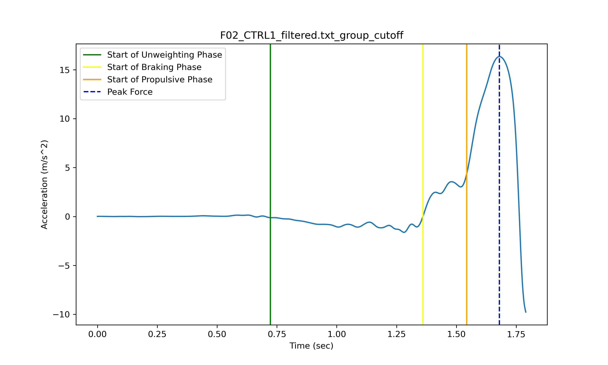
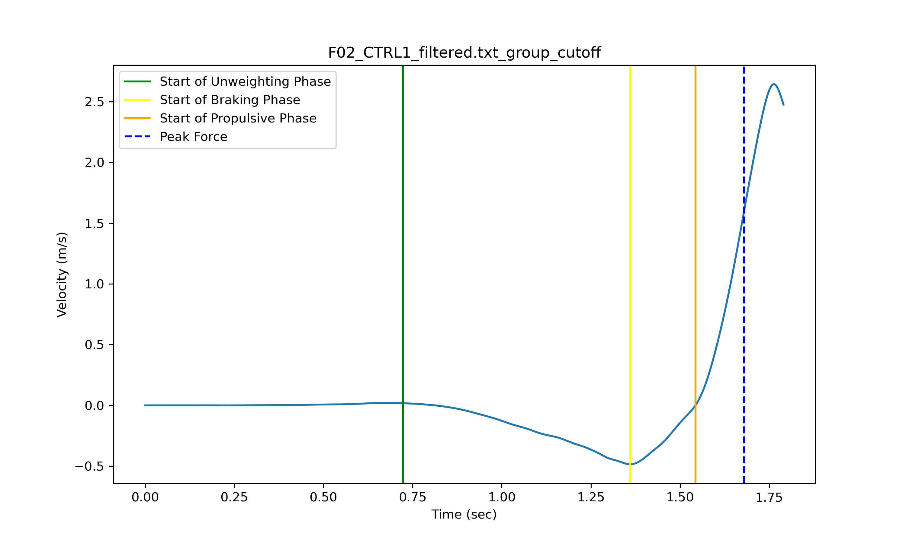
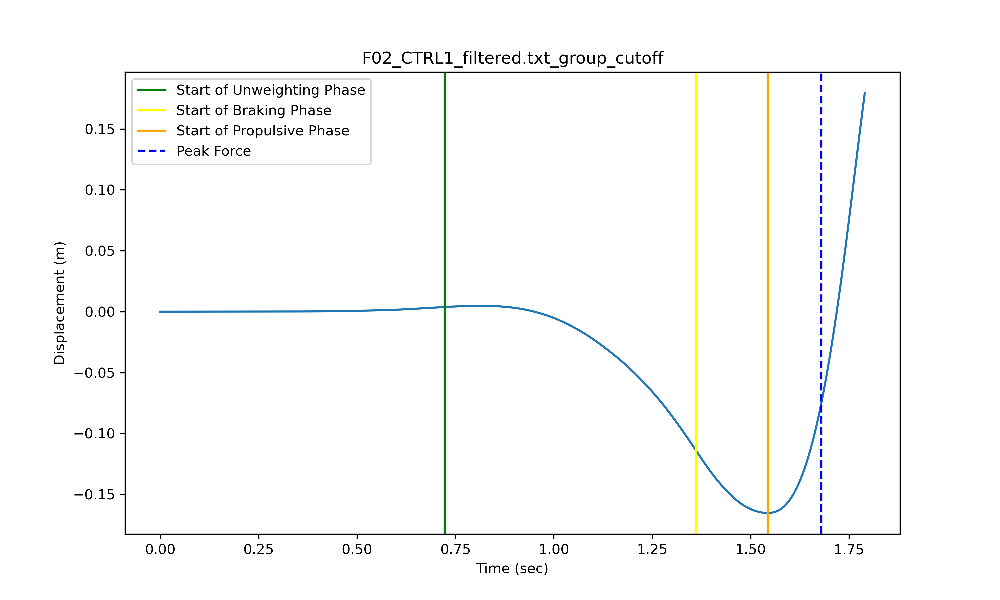
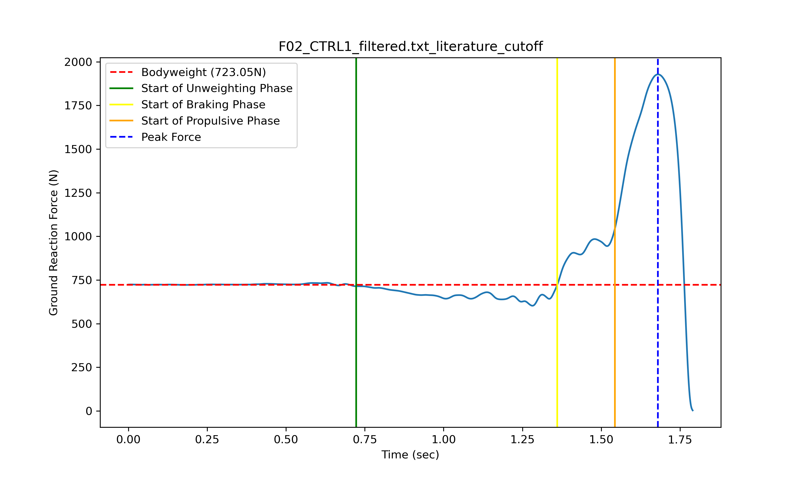
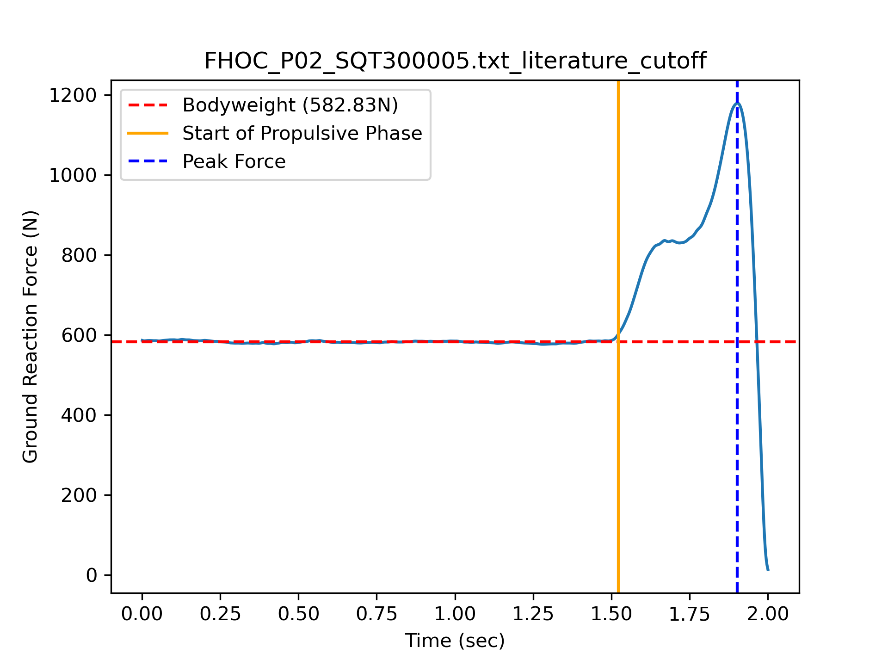
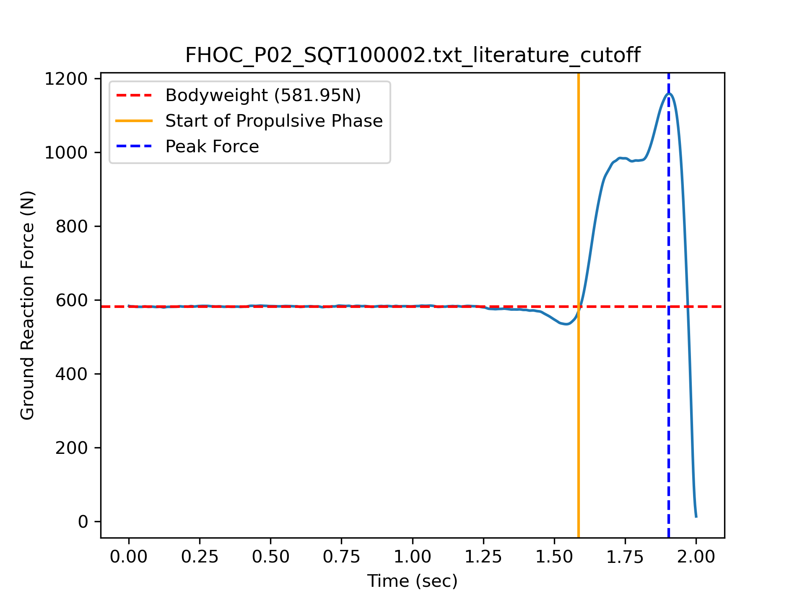

# Summary

Researchers and practitioners (e.g., sports team scientists, analysts, or coaches) commonly assess countermovement jump and squat jump performance on force plates. A countermovement jump involves a vertical jump where the jumper first dips downwards before immediately jumping upwards as high as possible. In contrast, a squat jump is a vertical jump whereby the jumper pauses briefly in the bottom "squat" position after dipping downards, and then jumps upwards to minimize contributions from the stretch-shortening cycle. A scientist, analyst, or coach can use data from these vertical jump variations for various reasons, such as to evaluate people's neuromuscular capacity, injury risk, or readiness/preparedness for high-intensity training. For evaluating capacity, some researchers have examined variables such as maximum jump height, peak force, rate of force development, and impulse `[@mcmahon:2017]`. When assessing injury risk, researchers have examined landing forces (e.g., `[@pedley2020]`) or have leveraged statistical techniques on various countermovement jump variables simultaneously `[@bird:2022]`. For training readiness, researchers have measured changes in vertical jump height between consecutive training sessions (e.g., `[@watkins:2017]`). Examining the difference in performance between the two jump variations may also provide insights into the strengths and weaknesses of the athlete to direct future training `[@vanHooren2017]`. For example, some researchers may compute an "eccentric utilization ratio" by comparing metrics from the countermovement jump relative to the squat jump and use that to inform whether someone should focus their training on improving their ability to leverage the stretch shortening cycle to maximize jumping performance `[@vanHooren2017]`. Although it is common to collect this kinetic data from a force plate for these jump variations for several applications, there are currently no free, open-source resources to detect events and compute metrics for reproducible and accessible data processing. `JumpMetrics` fills this gap in both applied practice and in the sports science literature.

# Statement of need

`JumpMetrics` is a free, open-source Python package for computing countermovement jump and squat jump events and metrics. Currently, there are no free alternatives for processing force plate data for vertical jumps relative to the numerous proprietary (i.e., closed-source) algorithms sold by commercial force plates companies (e.g., Vald, Hawkin Dynamics). This makes both the analyses, and ensuring reproducibility of results from these analyses, more challenging for the various professionals conducting jump analyses from force plate data. The API for `JumpMetrics` was designed to be modular and easy to use for those familiar with Python. Researchers, data scientists, analysts, and even coaches can examine each jump's takeoff and landing phases individually or together, depending on their needs and research questions. Furthermore, `JumpMetrics` provides various helper functions to prepare the data for detecting events and computing metrics. These helper functions involve cropping longer force traces and digitally low-pass filtering time series data (if these processing steps are required for a researcher or practitioner's particular analysis). In addition to its applications in sports science research and in professional practice, `JumpMetrics` can also be leveraged by undergraduate or graduate students to assist with sport or exercise science-related projects. Finally, the code, docstrings, and documentation provided in this package may help sports science students learn Python programming if they aren't already familiar.

# State of the Field

Force plate analysis for vertical jumps has traditionally been dominated by proprietary software solutions from commercial manufacturers such as Vald (ForceDecks) and Hawkin Dynamics, which provide closed-source algorithms for event detection and metrics computation. While these commercial platforms offer comprehensive solutions, they limit reproducibility and accessibility for researchers and practitioners with budget constraints. Furthermore, although these solutions may provide APIs for practitioners to build their own data pipelines, they offer limited flexibility for tuning the actual algorithms to compute jump-related metrics.

Several open-source tools exist for biomechanical analysis, though none specifically address force plate-based countermovement and squat jump analysis in Python. `biomechZoo` [@dixon:2017] is a MATLAB-based toolbox providing general biomechanical data processing capabilities, including ground reaction force processing. However, it requires MATLAB licensing and is not jump-specific. The R-based `shiny-vertical-jump` application (GPL-3.0 license on GitHub at [mattsams89/shiny-vertical-jump](https://github.com/mattsams89/shiny-vertical-jump)) provides vertical jump analysis functionality but operates within the R ecosystem. Other open-source alternatives like `Chronojump` and video-based tools (e.g., `Kinovea`) utilize different measurement modalities (jump mats or computer vision) rather than force plates.

`JumpMetrics` fills a unique gap as the first Python-based, open-source toolkit specifically designed for force plate analysis of countermovement and squat jumps. By integrating with the scientific Python ecosystem (NumPy, SciPy, pandas, matplotlib), it provides accessible, reproducible jump analysis for researchers, practitioners, and students without licensing costs or proprietary constraints. Furthermore, it provides flexibility to tune analyses based on the unique constraints and needs of researchers and practitioners.

# Software Design

The design of `JumpMetrics` prioritizes modularity, extensibility, and integration with the scientific Python ecosystem. The architecture follows three core principles. First, object-oriented processor classes provide a consistent API across jump types. All processor classes inherit from a common `ForceTimeCurveTakeoffProcessor` base class that handles kinematic calculations (acceleration, velocity, displacement) via numerical integration. Specialized classes (`ForceTimeCurveCMJTakeoffProcessor`, `ForceTimeCurveSQJTakeoffProcessor`, `ForceTimeCurveJumpLandingProcessor`) implement jump-specific event detection algorithms while maintaining a uniform interface for metric computation. Second, the dual-level API design supports both rapid batch processing and fine-grained analysis. The high-level `process_jump_trial()` wrapper function handles complete pipelines (cropping, filtering, event detection, metrics computation) for batch processing scenarios. Alternatively, users can directly instantiate processor classes for granular control over individual processing steps, custom visualizations, or algorithm debugging. Finally, tunable parameters with sensible defaults balance ease-of-use with adaptability. Event detection thresholds, filtering parameters, and phase duration criteria all use default values validated against real force plate data, but remain configurable to accommodate different experimental protocols and data collection methodologies.

This design reflects trade-offs between simplicity and flexibility: default parameters enable immediate use for standard protocols, while exposed parameters allow researchers to adapt algorithms to novel jump variations, research designs, or equipment constraints. Integration with SciPy's signal processing, pandas DataFrames, and matplotlib visualization ensures compatibility with existing scientific Python workflows. 

# How the Library Works
## Event Detections and Metrics
`JumpMetrics` computes various events and metrics for the countermovement and squat jump leveraging the vertical axis data from a force plate. The events (and thus metrics) are slightly different between the jump variations, given the differences in their movement executions. There are classes for processing various phases of the countermovement jump, a helper function to process the entire jump and landing, as well as individual functions for even more granularity for analyses. Furthermore, `JumpMetrics` computes the vertical axis acceleration, velocity, and displacement of the estimated center of mass trajectory for each frame of data, irrespective of whether one is using a triaxial or uniaxial force plate. These data are computed by first dividing the force trace by the individual's computed bodymass to obtain the acceleration data. Then, the acceleration signal is integrated to compute the instantaneous velocity. Finally, the signal is integrated one more time to compute the instataneous displacement. Some examples of these computed waveforms are shown in Figures 1, 2, and 3.

{ width=100% }

Figure 1. Example countermovement jump acceleration trace with events detected during the takeoff phase. Positive accelerations represent the center of mass accelerating upwards, whereas negative accelerations represent the center of mass accelerating downwards towards the floor/force plate.

{ width=100% }

Figure 2. Example countermovement jump velocity trace with events detected during the takeoff phase. Positive velocities represent the center of mass is moving upwards, whereas negative velocities represent the center of mass moving downwards.

{ width=100% }

Figure 3. Example countermovement jump displacement trace with events detected during the takeoff phase. Positive displacements represent the center of mass being higher relative to quiet standing, whereas negative displacements represent the center of mass being closer to the floor relative to quiet standing.

To compute the relevant events and metrics, there are specific methods that a user should adhere to that are outlined in `@mcmahon:2018`. These methods underpin the assumptions required to collect and process data with the code provided in this package. First, the jumper must stand still (i.e., minimizing swaying or any other body movements) at the start of the data collection and for at least 1 second before starting the initiation of the jump. This quiet standing is used to calculate one's bodyweight, and bodyweight is used for subsequent acceleration, velocity, and displacement calculations used for event detections (as well as for computing net vertical impulse). The default setting in this package is currently to use the first 0.4 seconds of the trial to compute bodyweight (as this was found to work well for previous analyses), but users can tune this parameter themselves for their own data collections depending on the length of the quiet standing at the start of the data collection. For a countermovement jump, the functions in this package also require the person to perform one continuous downwards and upwards motion during the jump; any pausing may negatively impact the event detection algorithms provided. In contrast, for the squat jump the default parameter for identifying the start of the propulsive phase expects at least a 1 second pause. In practice, previous research has outlined a pause should be approximately 3 seconds `[@vanHooren2017]`. The functions provided in `JumpMetrics` permit the user to select a different minimum pause to assume if the default of 1 second is not appropriate for their research.

### Phases Until Takeoff
#### Countermovement Jumps
There are two main phases preceeding the moment of takeoff during countermovement jumps. The two phases are the "lowering" (sometimes referred to as the eccentric) and "ascending" (sometimes referred to as the concentric) phases. The specific events within these two phases detected in this package are based on `@mcmahon:2018`. Each event corresponds the start of each subphase within the jump. These involve: 1) the start of the unweighting phase, 2) the start of the braking phase, 3) the start of the propulsive phase (the event which separates the lowering and ascending phases), 4) the frame corresponding to the peak force, and 5) the frame corresponding to takeoff.

`JumpMetrics` computes the start of the unweighting phase in the same manner as outlined in `@owen:2014` whereby the first frame of force data that exceeds five times the standard deviation of the force data (default value; this is a tuneable parameter depending on the data collection parameters) during quiet standing (sometimes referred to as the weighing phase) defines the start of the unweighting phase. The braking phase starts at the frame corresponding to the maximum downward movement velocity (of the individual's estimated center of mass; see Figure 2). The propulsive phase starts at the frame corresponding to the minimum downward displacement (of the individual's estimated center of mass; see Figure 3). This event is used because it is reliably detected and avoids any potential awkwardness of using a minimum positive velocity to define the start of this event whereby the person is moving upwards, but is still considered to be in the "braking" phase (e.g., if the minimum threshold to determine the start of the propulsive phase is 0.10m/s, but the person is currently moving 0.05m/s upwards they would still be in the "braking" phase). The peak force event is captured using `find_peaks` from the `scipy` package and looks for a "peak" in the force series. The takeoff event is detected by looking for the first frame of data whereby the force series is below a certain threshold (default is 10 Newtons) for a specific period of time (default is 0.25 seconds). `JumpMetrics` makes these various parameters for detecting events tunable in cases where the defaults may not accurately detect events due to unexpected noise in the data or if there are any changes in the methodology proposed with future research.

{ width=100% }

Figure 4. Example countermovement jump force-time trace with events detected during the takeoff phase.

`JumpMetrics` computes the rate of force development, net vertical impulse, and average force between all events detected during the countermovement jump. Additionally, metrics such as the jump height (based on the net vertical impulse using the impulse-momentum relationship as well as the center of mass velocity at the final frame of data before takeoff), takeoff velocity, movement time, unweighting time, braking time, propulsive time, and lowering displacement are also all computed. Table 1 contains a complete list of the metrics `JumpMetrics` exports for countermovement jumps. Note that in order for the events and metrics to be computed accurately, a brief weighing phase (default is the first 0.25 seconds of data, but this can be modified depending on how long the individual was standing) must be present at the start of the waveform in order to determine the individual's bodyweight and to detect subsequent jump events. Table 2 contains a small sample of how, more generally, some of the metrics computed in `JumpMetrics` can be leveraged for various applications (please note that this table only covers potential applications and the final decision of when to use a particular metric is dependent on how the data is collected and the particular research question the analyst wishes to answer). Critically, the helper functions in jump metrics, such as `compute_rfd` (i.e., compute rate of force development) allow the user to easily compute any necessary metric beyond the defaults computed in the current version of this package. 

#### Squat Jumps
Given that the squat jump is intentionally performed with a pause to minimize the influence of the stretch shortening cycle of the lower body muscles from a continuous countermovement (i.e., there is no lowering phase), the only events `JumpMetrics` detects are are the start of the propulsive phase, the peak force event, and the takeoff event. The start of the propulsive phase is the first frame of data that exceeds five times the standard deviation of the force data (default value; this is a tuneable parameter depending on the data collection parameters) during the squat phase. The peak force event is computed similarly to the countermovement jumps whereby `find_peaks` from the `scipy` package and looks for a "peak" in the force series. The takeoff event is detected by looking for the first frame of data whereby the force series is below a certain threshold (default is 10 Newtons) for a specific period of time (default is 0.25 seconds).
{ width=100% }

Figure 5. Example squat jump force-time trace during the takeoff phase.

Although there is not supposed to be any countermovement/lowering phase during a squat jump, depending on the instructions and guidance provided to the participant, as well as their general movement behaviours, there may be a minor countermovement that would negate the trial from being a true squat jump. `JumpMetrics` detects and flags this motion (with a warning and an estimated frame in the metrics output) to make the user aware of this potential flaw in the squat jump trial.
{ width=100% }

Figure 6. Example squat jump force-time trace with an inappropriate countermovement detected during the takeoff phase.

`JumpMetrics` computes the rate of force development, net vertical impulse, and average force between all events detected during the squat jump. Additionally, metrics such as the jump height (based on the net vertical impulse and using the impulse-momentum relationship and the velocity at the final frame of data before takeoff), takeoff velocity, movement time, and propulsive time are also all computed. Table 1 contains a complete list of the metrics `JumpMetrics` exports for squat jumps. Note that in order for the events and metrics to be computed accurately, a brief weighing phase (default is the first 0.25 seconds of data, but this can be modified depending on how long the individual was standing) must be present in the waveform in order to determine the individual's bodyweight.

### Landing Phase
The landing phase is defined by the methodology outlined in `@mcmahon:2018`. The initial landing event is detected by looking for the first frame of data whereby the force series is above a certain threshold (default is 20 Newtons) for a specific period of time (default is 0.015 seconds). The landing phase's end is the point where the estimated center of mass velocity becomes greater than, or equal to, 0 meters per second (given that a negative velocity represents a downward movement).

During the jump's landing phase, `JumpMetrics` computes the maximum landing force, average landing force, landing time, landing displacement, and various landing rate of force development metrics.

## Wrapper Function
There is also a wrapper function named `process_jump_trial()` that combines the classes for both the phases up to takeoff and following the landing of the jump to compute all relevant events and metrics. Additionally, because this function uses the entire force trace as its input, this function also computes two additional metrics. These metrics are the jump height based on the flight time (i.e., the between takeoff and landing) as well as the flight time itself. Although jump height based on flight time is less robust relative to jump height based on the impulse-momentum theorem `[@xu:2023]`, the flight time jump height is still included for researchers or practitioners who may have historical reference data using this method.

# Tables

Table 1. Specific metrics computed and exported by `JumpMetrics` at Takeoff for Countermovement Jumps (CMJ) and Squat Jumps (SQJ).
| Metric                                               | CMJ | SQJ | Description                    |
|------------------------------------------------------|-----|-----|--------------------------------|
| propulsive_peakforce_rfd_slope_between_events         | yes   | yes   |Rate of force development computed as the slope between the start of the propulsive phase to the frame of peak force (N/s)|
| propulsive_peakforce_rfd_instantaneous_average_between_events | yes   | yes   |Rate of force development computed as the average instantaneous value between each frame the start of the propulsive phase to the frame of peak force (N/s)|
| propulsive_peakforce_rfd_instantaneous_peak_between_events | yes   | yes   |Rate of force development computed as the peak instantaneous value between each frame the start of the propulsive phase to the frame of peak force (N/s)|
| braking_peakforce_rfd_slope_between_events            | yes   |     |Rate of force development computed as the slope between the start of the braking phase to the frame of peak force (N/s)|
| braking_peakforce_rfd_instantaneous_average_between_events | yes   |     |Rate of force development computed as the average instantaneous value between each frame during the start of the braking phase to the frame of peak force (N/s)|
| braking_peakforce_rfd_instantaneous_peak_between_events | yes   |     |Rate of force development computed as the peak instantaneous value between each frame during the start of the braking phase to the frame of peak force (N/s)|
| braking_propulsive_rfd_slope_between_events           | yes   |     |Rate of force development slope from the braking phase to the start of the propulsive phase (N/s)|
| braking_propulsive_rfd_instantaneous_average_between_events | yes   |     |Rate of force development computed as the average instantaneous value from the braking to the propulsive phase (N/s)|
| braking_propulsive_rfd_instantaneous_peak_between_events | yes   |     |Rate of force development computed as the peak instantaneous value from braking to the propulsive phase (N/s)|
| braking_net_vertical_impulse                          | yes   |     |Net vertical impulse during the braking phase (N⋅s)|
| propulsive_net_vertical_impulse                       | yes   |     |Net vertical impulse during the propulsive phase (N⋅s)|
| braking_to_propulsive_net_vertical_impulse            | yes   |     |Net vertical impulse between the start of the braking phase to the propulsive phase (N⋅s)|
| total_net_vertical_impulse                            | yes   | yes   |Net vertical impulse during the entire jump (N⋅s)|
| peak_force                                            | yes   | yes   |Peak force defined using find_peaks() in scipy (N)|
| maximum_force                                         | yes   | yes   |Global maximum value of force recorded during the jump (N)|
| average_force_of_braking_phase                        | yes   |     |Average force applied during the braking phase (N)|
| average_force_of_propulsive_phase                     | yes   | yes   |Average force applied during the propulsive phase (N)|
| takeoff_velocity                                      | yes   | yes   |Estimated takeoff velocity of the center of mass (m/s)|
| jump_height_takeoff_velocity                          | yes   | yes   |Jump height calculated using the estimated takeoff velocity of the center of mass (m)|
| jump_height_net_vertical_impulse                      | yes   | yes   |Jump height calculated using the impulse-momentum theorem. Usually identical to the jump height based on takeoff velocity except for rounding errors due to slightly different computations (m)|
| jump_height_flight_time**                             | yes   | yes   |Jump height calculated using flight time (m)|
| flight_time**                                         | yes   | yes   |Flight time of the jump (s)|
| movement_time                                         | yes   | yes   |Time between initiation of jump and takeoff (s)|
| unweighting_time                                      | yes   |     |Time during the unweighting phase of the jump (s)|
| braking_time                                          | yes   |     |Time during the braking phase of the jump (s)|
| propulsive_time                                       | yes   | yes   |Time during the propulsive phase of the jump (s)|
| lowering_displacement                                 | yes   |     |Estimated displacement of the center of mass during the lowering phase (m)|
| frame_start_of_unweighting_phase                      | yes   |     |Frame corresponding to the start of the unweighting phase|
| frame_start_of_breaking_phase                         | yes   |     |Frame corresponding to the start of the braking phase|
| frame_start_of_propulsive_phase                       | yes   | yes   |Frame corresponding to the start of the propulsive phase|
| frame_peak_force                                      | yes   | yes   |Frame corresponding to the peak force during the jump|
| frame_of_potential_unweighting_start                  |     | yes   |Frame corresponding to the potential start of the unweighting phase|

Table 2. Table of general metrics along with potential typical applications. Note that the appropriateness of a potential metric for the listed purpose (or beyond the listed purpose) is dependent on how the data was collected and the particular question the analyst is attempting to answer. This table is a guide only based on a limited selection of papers.

| General Metric        | Capacity | Injury Risk | Readiness | Example Paper(s) |
|-----------------------|----------|-------------|-----------|------------------|
| RFD (Rate of Force Development) |yes         |yes            |           |`[@mcmahon:2017]`, `[@bird:2022]`|
| Net Vertical Impulse  |yes         |yes            |           |`[@mcmahon:2017]`, `[@bird:2022]`|
| Peak Force            |yes         |yes (during landing)|           |`[@mcmahon:2017]`, `[@pedley2020]`|
| Maximum Force         |yes         |yes (during landing)|           |`[@mcmahon:2017]`, `[@pedley2020]`|
| Jump Height           |yes         |             |yes          |`[@watkins:2017]`, `[@mcmahon:2017]`|
| Braking Time          |          |yes            |           |`[@bird:2022]`|
| Propulsive Time       |          |yes            |           |`[@bird:2022]`|

Note that `jump_height_flight_time` and `flight_time` are only available when using the `process_jump_trial()` function as both takeoff and landing must be detected to determine the flight time.

# Research Impact

Since its initial release in June 2024, `JumpMetrics` has begun establishing itself within the biomechanics research and sports science communities. The software is currently being used by external researchers and practitioners for force plate jump analysis, with adoption in educational settings for teaching biomechanics concepts in sports science programs.

As the only open-source, Python-based tool specifically designed for force plate countermovement and squat jump analysis, `JumpMetrics` addresses a critical gap in accessible biomechanical analysis tools. The project demonstrates active development and maintains comprehensive test coverage (84% overall, 100% on critical algorithms) across 203 unit and integration tests at the time of publication, ensuring reliability for scientific applications.

The GitHub repository has garnered interest from the biomechanics community with 12 stars and community engagement at the time of writing, indicating recognition of its value for reproducible jump analysis. As the software matures, it will provide a foundation for reproducible research in jump biomechanics, enabling researchers worldwide to apply consistent, validated algorithms without proprietary software constraints.

Beyond immediate research applications, `JumpMetrics` serves as an educational resource for students learning both biomechanical analysis and scientific Python programming, with comprehensive documentation and example workflows demonstrating best practices in sports science data analysis.

# AI Usage Disclosure

No generative AI tools were used in the development of this software, the writing of this manuscript, or the preparation of supporting materials.

# Acknowledgements

I acknowledge contributions from Malinda Hapuarachchi for providing the data required to develop, test, and verify the functions in this package. I also wish to acknowledge Jacob Rauch for his feedback on the paper.

# References
